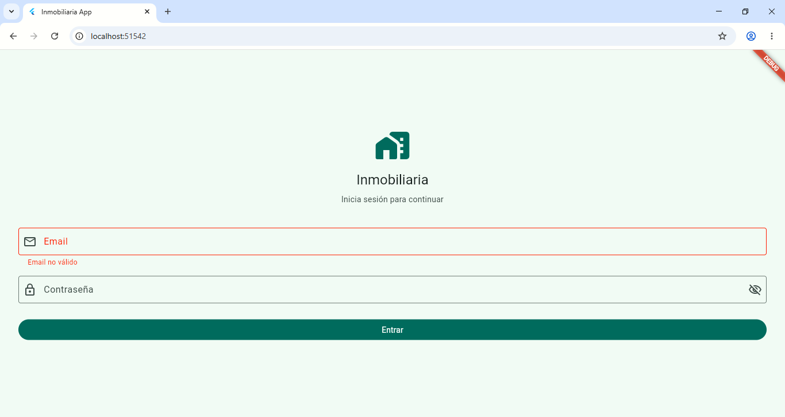
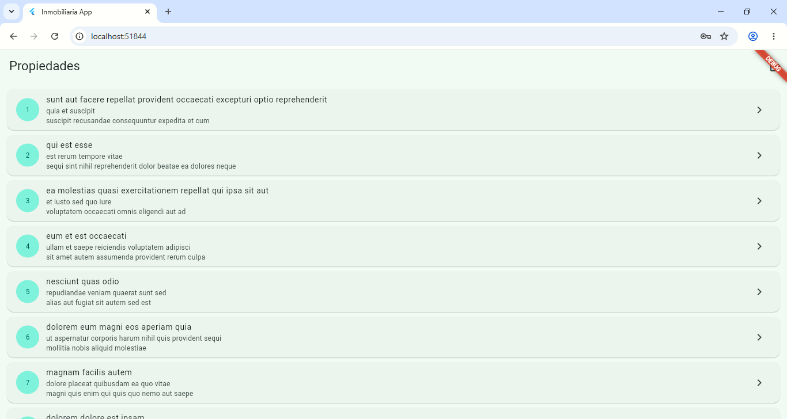
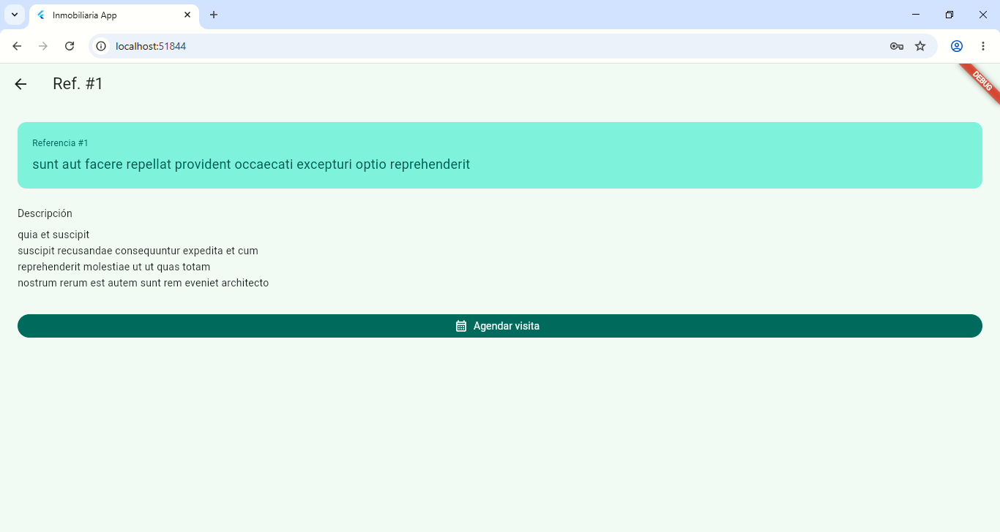

# Inmobiliaria App — Flutter

App móvil multiplataforma de gestión inmobiliaria en campo.
Desarrollada en Flutter como evolución de la app Android original.

## Pantallas

### Login

### Lista de propiedades (API REST)

### Detalle de propiedad

## Funcionalidades
- Login con validación de formulario y mostrar/ocultar contraseña
- Listado de propiedades consumiendo API REST en tiempo real
- Pull to refresh para actualizar la lista
- Pantalla de detalle con navegación y paso de datos
- Manejo de errores de red con opción de reintentar
- Tema oscuro y claro automático según el sistema

## Tecnologías
Flutter · Dart · REST API · JSON · Material Design 3

## App Android original
La versión Android completa (Java · Kotlin · Firebase · firma digital):
[CasaBlanca Inmobiliaria App](https://github.com/TU-USERNAME/casablanca-inmobiliaria-app)
